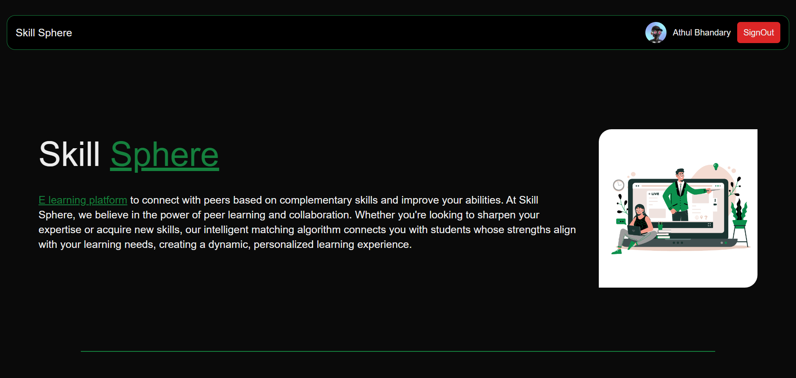

## N.M.A.M. Institute of Technology - FinTech Fusion
Team Members:
Athul D Bhandary 

## Problem Statement
### 3. Theme: Improving Work Efficiency
 3.2 Problem Statement: Intelligent Peer Learning Platform

## Instructions on running your project

### Step 1: Clone the Repository
Open your terminal and run the following commands:

```bash
git clone <repository-url>
cd <repository-folder>
```

### Step 2: Setup the frontend
Navigate to the folder
```bash
cd code/frontend
```

Install dependencies
```bash
npm install
```
Start the Next.js development server:
```bash
npm run dev
```

The frontend will be running at http://localhost:3000

### Step 3: Set up the backend
In a new terminal window, navigate to the backend folder:
```bash
cd code/backend
```

Install dependencies
```bash
npm install
```

Start the express server
```bash
npm start
```


## References

### Official Documentation
- [Next.js Documentation](https://nextjs.org/docs) – Learn more about Next.js, server-side rendering, and routing.
- [Auth.js Documentation](https://authjs.dev/getting-started/introduction) – Official documentation for Auth.js (formerly NextAuth.js).
- [TailwindCSS Documentation](https://tailwindcss.com/docs) – Guide to using TailwindCSS for styling.
- [Express.js Documentation](https://expressjs.com/) – Reference for building APIs and handling backend logic.
- [Socket.io Documentation](https://socket.io/docs/) – Official Socket.io documentation for real-time communication.
- [Prisma Documentation](https://www.prisma.io/docs) – Official Prisma ORM documentation for database management.